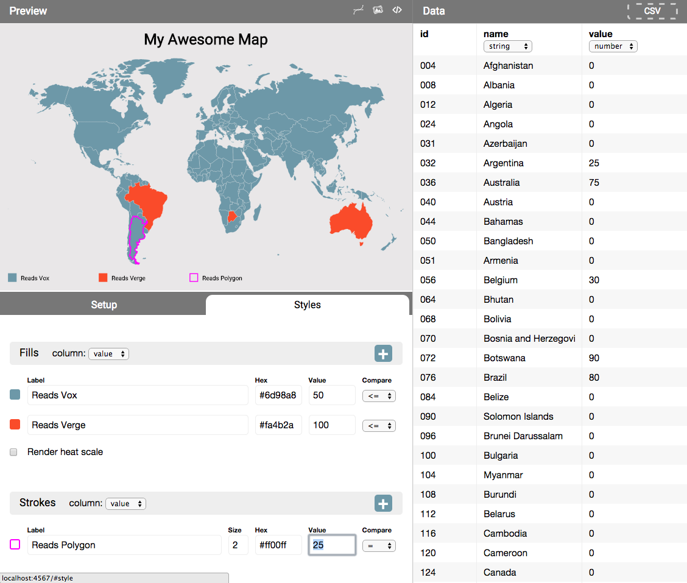

# mapper

This tool uses D3 to generate choropleth map graphics based upon a data set. Drop in your CSV data, configure your color thresholds, and adjust your display settings. This is a proof of concept app that still needs many features built out, however we welcome any editorial community to use this as a starting point for building great mapping tools. Existing features:

 - World and US State maps.
 - Thresholds and heat scale fill rendering.
 - Stroke rendering for select shapes.
 - Basic legend layout.
 - Export as PNG
 - Export as SVG (needs cleanup)
 - Interactive tooltip (needs interactive export option)



## Getting Started

**1) Install Middleman and the app:**

```
gem install middleman
cd mapper
bundle install
```

**2) To run the app:**

```
bundle exec middleman
```

The app should startup at `localhost:4567`.

**3) To build the app:**

```
bundle exec middleman build
```

This will generate a static `/build` directory with flat HTML, CSS, and JS files that may be uploaded to any web server.

## Documentation

Use the provided CSV templates to format your data:

- `csv/us-state.csv`
- `csv/world.csv`

You may add additional columns to those data templates. The mapper application only requires that the `id` column remain unchanged for mapping shapes to data rows.

## Contribute

This is a proof of concept project and we encourage contributions. [Please review our guidelines and code of conduct before contributing](https://github.com/voxmedia/open-source-contribution-guidelines).

## Author(s)

- Greg MacWilliam, Vox Media.
